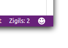

# zigil-finder

a C-style string literal ('Zigil') highlighter.
strings wrapped in qoutation (both single and double) 'Zigils' are being highlighted and shown in ruler. just like errors etc.

this helps the Internationalization process of your files when you want to replace hard coded strings with the output of your favorite i18n engine.
## Features
highlight colors are according to light and dark themes:

number of Zigils are shown in status bar:

## Release Notes

this is my first extension! be nice to me!

### 1.0.0

Initial release
